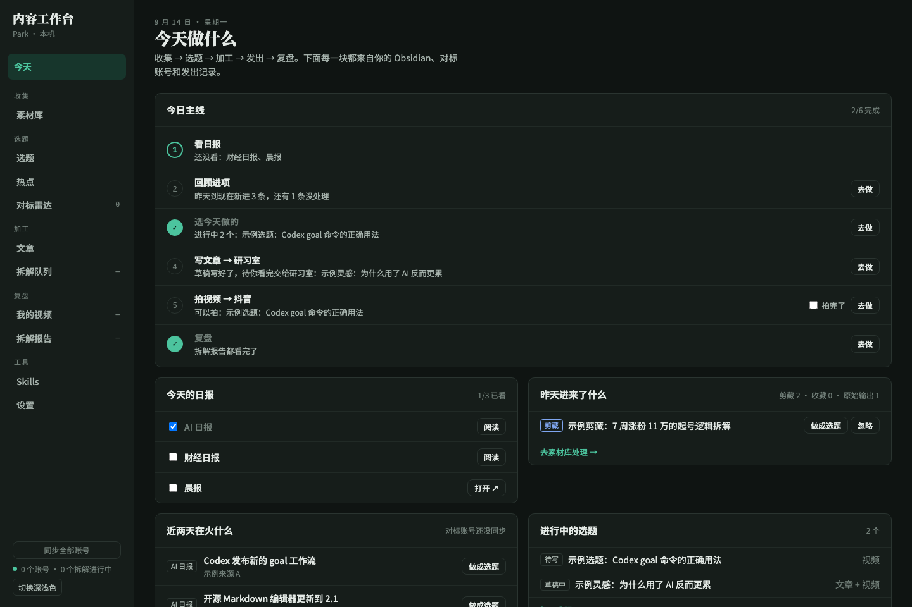
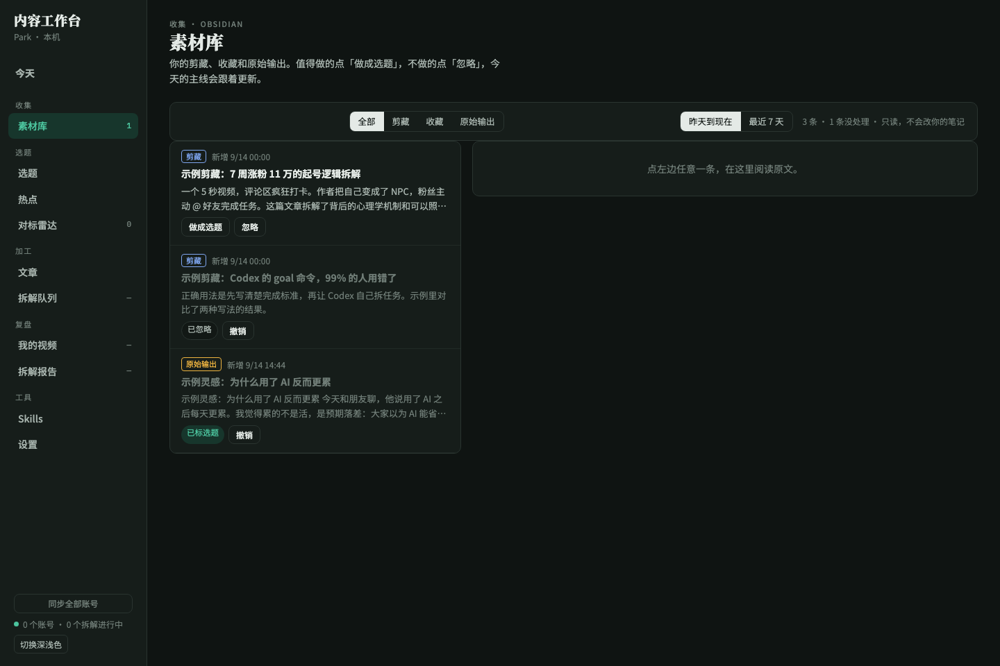
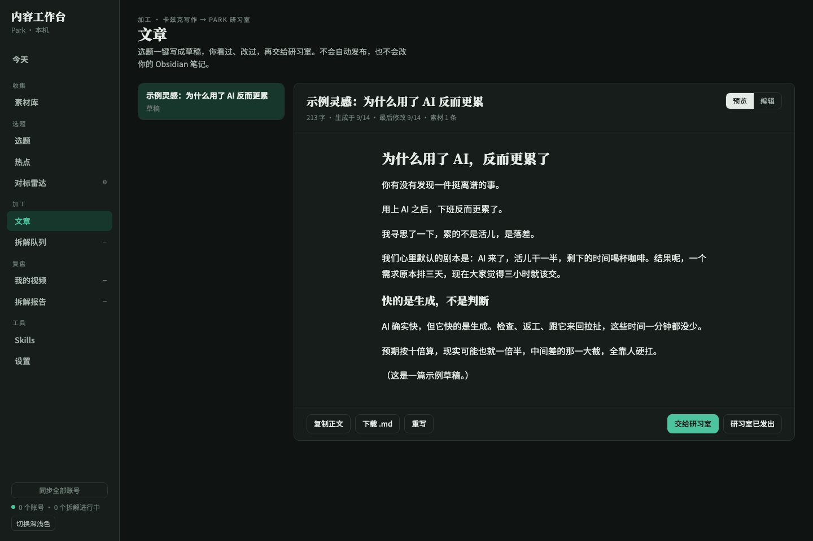
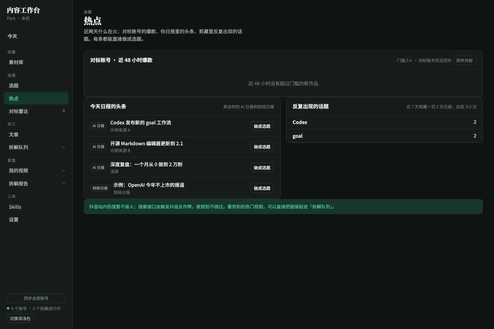
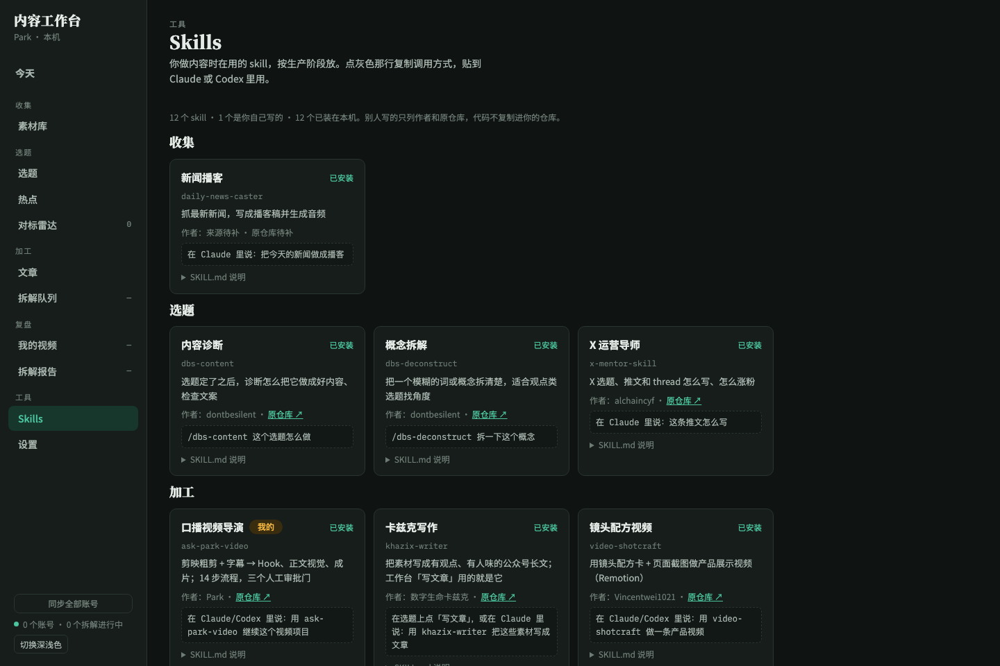

<div align="center">

# 内容工作台 · content-studio

**把一个人的内容生产串成每天一条主线：Obsidian 进项 → 选题 → 文章 / 视频 → 发出 → 爆款复盘**

[](https://python.org)
[](https://fastapi.tiangolo.com)
[](https://sqlite.org)
[](https://docs.anthropic.com/en/docs/claude-code)
[](#license)

</div>

---

```
in   Obsidian 库（剪藏 / 收藏 / 原始输出 / AI 与财经日报） + 抖音账号主页链接 + 视频链接
out  今日主线（6 步，自动判定完成） + 选题看板 + 卡兹克写作文章草稿 + 抖音爆款拆解报告

fail Obsidian 路径不存在      → 页面提示去设置，其它功能照常
fail 抖音 cookies 缺失/过期   → 顶部提示重新导出，不发请求
fail 抖音验证页 / 反作弊      → 立即停止抓取并显示原因，不绕过
fail 本机 claude 未登录       → 任务标失败并写明「重新登录后点重试」，不空转重试
fail 模型输出不合格          → 带错误重试，仍失败则保留原因可手动重试
```

这是 Park 自己的内容工作流，不追求普适。它只在本机运行：笔记只读、cookies 与数据不出本机、不代发布任何平台内容。

## 示例输出

> 下面的截图来自演示实例，内容是示例数据。

**今天**：打开就知道今天做什么。主线的每一步由数据自动判断完成，没做完的选题留到第二天。



**素材库**：只读 Obsidian 的剪藏、收藏、原始输出，值得做的「做成选题」，不做的「忽略」。



**文章**：选题一键交给卡兹克写作 skill 出草稿（作者是 Park，不带原作者署名），预览、编辑、复制、下载，再交给 Park 研习室。



**热点**：对标账号 48 小时爆款、日报头条、剪藏里反复出现的话题。



**Skills**：做内容在用的 skill，按生产阶段放，写明作者和原仓库。



## 一天怎么用

| 步 | 在哪 | 做什么 | 怎么算完成 |
|---|---|---|---|
| 1 看日报 | 今天 | 读 AI 日报、财经日报、晨报 | 当天已出的日报都勾了「已看」 |
| 2 回顾进项 | 素材库 | 昨天到现在的新笔记，逐条「做成选题」或「忽略」 | 没有未处理的进项 |
| 3 选今天做的 | 选题 / 热点 | 挑一条，定形式：文章 / 视频 / 两者 | 有进行中的选题 |
| 4 写文章 → 研习室 | 文章 | 写文章 → 看、改 → 交给研习室 → 标已发出 | 今天有文章发出 |
| 5 拍视频 → 抖音 | 选题 | 拍、剪、发 | 手动勾「拍完了」 |
| 6 复盘 | 我的视频 / 拆解报告 | 看爆款拆解，看完归档 | 报告都看完或今天归档过 |

## 架构

```
┌─────────────── Obsidian 库（只读，6 个白名单文件夹）───────────────┐
│  Clippings · 002_个人收藏 · 003_park原始输出 · 006/007/009 日报    │
└───────────────┬───────────────────────────────────────────────────┘
                ▼
┌──────────────────────────── FastAPI（127.0.0.1:8780）────────────────────────────┐
│ vault.py 收集   today.py 主线   hot.py 热点   skills.py 注册表   writer.py 文章     │
│ accounts.py 账号同步   worker.py 拆解队列   structure.py 结构拆解   store.py SQLite │
└──────┬───────────────────────┬──────────────────────────┬────────────────────────┘
       ▼                       ▼                          ▼
 content-downloader      content-extractor           本机 claude CLI
 抖音作品/下载（签名）    mlx-whisper 转写            结构判断 · khazix-writer 写作
       │                                                  │
       └──────────── ~/.config/content-studio/ ───────────┘
                     studio.sqlite3 · reports/ · drafts/（权限 600/700）
```

前端是原生 JS，每个页面一个文件（`today.js`、`collect.js`、`topics.js`、`hot.js`、`article.js`、`skills.js`），注册到 `window.VIEWS` / `window.TODAY_CARDS`。

## 快速开始

```bash
# 1. 克隆并安装
git clone https://github.com/zinan92/content-studio.git
cd content-studio
python3 -m pip install -e '.[dev]'

# 2. 依赖的两个本机能力
git clone https://github.com/zinan92/content-downloader.git ~/work/content-downloader   # 或设 CONTENT_DOWNLOADER_PATH
python3 -m pip install git+https://github.com/zinan92/content-extractor.git

# 3. 启动
python3 -m content_studio serve
# 打开 http://127.0.0.1:8780 ，在「设置」里填 Obsidian 库路径
```

- 抖音功能需要浏览器登录抖音网页版与创作者中心后，把 cookies 导出到 `~/.config/content-studio/douyin-cookies.json`（权限 `600`）。
- 拆解和写文章调用本机已登录的 [Claude Code](https://docs.anthropic.com/en/docs/claude-code) CLI；写文章需要安装 [khazix-writer](https://github.com/KKKKhazix/khazix-skills) skill。

## 功能一览

| 功能 | 说明 | 状态 |
|---|---|---|
| 今日主线 | 6 步流程，完成状态由数据自动判定，未完成的选题顺延 | 已完成 |
| 素材库 | 只读 Obsidian，Markdown 阅读器（净化），做成选题 / 忽略 | 已完成 |
| 选题 | 看板：待写 → 草稿中 → 待发 → 已发出，形式 文章/视频/两者 | 已完成 |
| 热点 | 对标 48h 爆款、日报头条、高频话题（本地统计） | 已完成 |
| 文章 | 卡兹克写作出草稿，编辑、复制、下载 .md、交给研习室 | 已完成 |
| Skills | 注册表 + 本机安装检测 + 调用方式 | 已完成 |
| 我的视频 | 作品数据 + 创作者后台（涨粉、完播、跳出、均看） | 已完成 |
| 对标雷达 | 加对标账号（抖音同步；小红书 / X / 视频号先入库），账号自身中位数算倍数 | 已完成 |
| 拆解队列与报告 | 下载 → 转写 → 模型判断结构 → 代码算数 → 原文回查；报告可归档 | 已完成 |
| 多账号 | 我的账号可以有多个，左下角切换 | 已完成 |
| 研习室自动进草稿箱 | 走研习室设备接口 | 计划中（[#31](https://github.com/zinan92/content-studio/issues/31)） |
| 视频线 | 口播稿、剪辑、抖音发出记录 | 计划中 |
| 抖音站内热搜 | 搜索接口触发反作弊，按规则不做 | 不做 |

## 用到的 Skills

别人写的 skill 只列名字、作者和原仓库，代码不复制进本仓库（有测试守护）。

| Skill | 用在哪一步 | 作者 | 原仓库 |
|---|---|---|---|
| ask-park-video | 加工 · 口播视频 | Park | [zinan92/park-koubo-workflow](https://github.com/zinan92/park-koubo-workflow) |
| khazix-writer | 加工 · 文章 | 数字生命卡兹克 | [KKKKhazix/khazix-skills](https://github.com/KKKKhazix/khazix-skills) |
| dbs-content / dbs-deconstruct / dbs-diagnosis / dbs-wechat-html | 选题 · 发出 · 复盘 | dontbesilent | [dontbesilent2025/dbskill](https://github.com/dontbesilent2025/dbskill) |
| video-shotcraft | 加工 · 产品视频 | Vincentwei1021 | [Vincentwei1021/video-shotcraft](https://github.com/Vincentwei1021/video-shotcraft) |
| gzh-design | 发出 · 公众号排版 | isjiamu | [isjiamu/gzh-design-skill](https://github.com/isjiamu/gzh-design-skill) |
| x-mentor-skill | 选题 · X | alchaincyf | [alchaincyf/x-mentor-skill](https://github.com/alchaincyf/x-mentor-skill) |
| baoyu-post-to-wechat | 发出 · 公众号 | 宝玉 | [JimLiu/baoyu-skills](https://github.com/JimLiu/baoyu-skills) |

完整名单与调用方式见 [`config/skills.json`](config/skills.json)。

## 边界

- **笔记只读**：只开放 6 个白名单文件夹，拒绝 `..`、绝对路径和软链逃逸；库里其它文件夹（包括密钥目录）不可达。库里的 HTML 以 `CSP: sandbox` 返回。
- **不代发布**：文章交给研习室由 Park 发布；抖音只读数据，不发、不评、不私信。
- **抓取克制**：串行、页间 ≥1.5 秒、每账号最多 3 页；遇验证页或反作弊立即停止。
- **数据本机**：cookies、SQLite、报告、草稿都在 `~/.config/content-studio/`，不进仓库。
- **拆解结论是假设**：结构标签与「为什么爆」是待验证的参考，不是爆款判定规则。

## 命令行

| 命令 | 作用 |
|---|---|
| `python3 -m content_studio serve` | 启动网页（默认 8780）并在后台串行处理拆解队列 |
| `python3 -m content_studio sync` | 同步所有抖音账号作品 + 自己的后台数据 + 自动入队爆款 |
| `python3 -m content_studio work` | 不开网页，把拆解队列跑完后退出 |
| `python3 -m content_studio add-account <主页链接> [--self]` | 命令行加账号 |
| `python3 -m content_studio creator-sync` | 只抓自己的创作者后台数据（最近 90 天） |
| `python3 -m content_studio pipeline --url <视频链接>` | 不入库，直接对链接出报告 |
| `python3 -m content_studio write-schedule` | 生成每日同步的 launchd 配置，只写文件不启用 |

## API 参考

| 方法 | 路径 | 说明 |
|---|---|---|
| `GET` | `/api/today/plan` | 今日主线 6 步与完成状态 |
| `GET` | `/api/today/dailies` · `PUT /api/today/checks` | 当天日报与「已看」 |
| `GET` | `/api/vault/inbox?days=1&source=` | 最近进项（剪藏 / 收藏 / 原始输出） |
| `GET` | `/api/vault/note?path=` | 读一条笔记（白名单内） |
| `PUT` | `/api/vault/triage` | 做成选题 / 忽略 / 撤销 |
| `GET` `POST` `PATCH` | `/api/topics` · `/api/topics/{id}` | 选题 |
| `POST` | `/api/topics/{id}/write` | 后台写文章 |
| `GET` `PUT` | `/api/topics/{id}/article` · `GET …/article.md` | 草稿读写与下载 |
| `POST` | `/api/topics/{id}/handoff` | 交给研习室（状态改待发，返回后台地址） |
| `GET` | `/api/hot` · `/api/skills` | 热点 · Skills |
| `GET` `POST` | `/api/accounts` · `/api/mine` · `/api/outliers` | 账号、我的视频、爆款 |
| `GET` `POST` | `/api/jobs` · `/api/reports` | 拆解队列与报告 |

## 配置

| 项 | 说明 | 默认值 |
|---|---|---|
| 设置 · Obsidian 库路径 | 读取进项的库 | `~/park-hands` |
| 设置 · 研习室电脑后台地址 | 「交给研习室」时打开 | 空 |
| 设置 · 爆款门槛 | 点赞 ÷ 账号自身中位数 | `5×` |
| `CONTENT_DOWNLOADER_PATH` | content-downloader 路径 | `~/work/content-downloader` |
| `CONTENT_STUDIO_LLM_CMD` | 结构拆解命令（stdin 提示词 → stdout JSON） | `claude -p --model sonnet …` |
| `CONTENT_STUDIO_WRITER_CMD` | 写文章命令 | `claude -p --model opus …`（允许 Skill/Read） |

## For AI Agents

```yaml
name: content-studio
version: 0.1.0
capability:
  summary: Local daily content-production workbench for one creator — Obsidian inbox to topics, khazix-writer article drafts, and Douyin breakout teardowns.
  in: Obsidian vault folders (read-only) + Douyin profile/video URLs
  out: today plan, topics, article drafts (Markdown), teardown reports (JSON/Markdown)
  fail:
    - "vault path missing → 404 with Chinese guidance"
    - "Douyin verification or anti-spam → stop, no retry"
    - "claude CLI logged out → task failed with re-login message"
api_base_url: http://127.0.0.1:8780
endpoints:
  - path: /api/today/plan
    method: GET
    description: six steps of today's line with done flags
  - path: /api/topics
    method: POST
    description: create a topic
    body:
      content_type: application/json
      schema:
        title: string
        formats: article|video|both
        note_paths: list[string]
  - path: /api/topics/{id}/write
    method: POST
    description: start writing an article draft in the background
install_command: python3 -m pip install -e '.[dev]'
start_command: python3 -m content_studio serve
health_check: GET /api/state
```

```python
import httpx, time

base = "http://127.0.0.1:8780"
plan = httpx.get(f"{base}/api/today/plan").json()
topic = httpx.post(f"{base}/api/topics", json={"title": "为什么用了 AI 反而更累", "formats": "article"}).json()
httpx.post(f"{base}/api/topics/{topic['id']}/write")
while httpx.get(f"{base}/api/topics").json()[0]["write_state"] == "running":
    time.sleep(10)
draft = httpx.get(f"{base}/api/topics/{topic['id']}/article").json()["markdown"]
```

## 相关项目

| 项目 | 关系 |
|---|---|
| [content-downloader](https://github.com/zinan92/content-downloader) | 抖音作品列表与视频下载的唯一入口 |
| [content-extractor](https://github.com/zinan92/content-extractor) | 视频转写（mlx-whisper） |
| [park-koubo-workflow](https://github.com/zinan92/park-koubo-workflow) | Park 的口播视频工作流 skill |
| [content-production](https://github.com/zinan92/content-production) | Content 宇宙注册表 |

## License

未指定。
